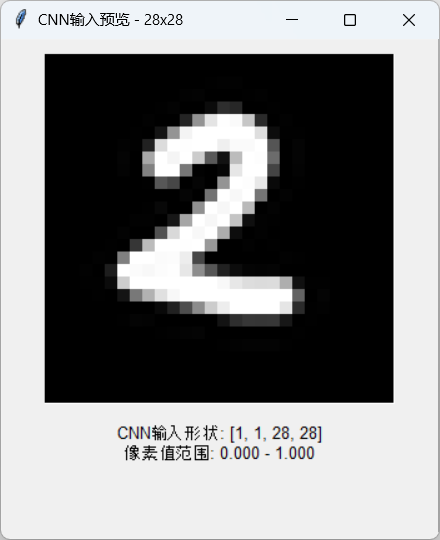

## 文件说明

### img_loader.py

可以查看 MNIST 数据集中的图片

### mnist_cnn.py

用 CNN 网络编写的程序，运行后可以训练并保存模型到文件 cnn_model.pth

### mnist_cnn_recognizer.py

可以从 cnn_model.pth 中加载模型，支持自己手写数字，让该模型识别，效果如下图所示

### mnist_fnn.py

用 FNN (Feedforward Neural Network) 编写的程序，训练后保存至 fnn_model.pth

### mnist_fnn_recognizer.py

从 fnn_model.pth 中加载模型，可自己手写让模型识别